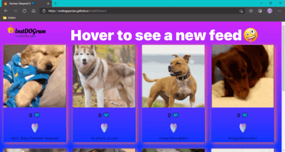
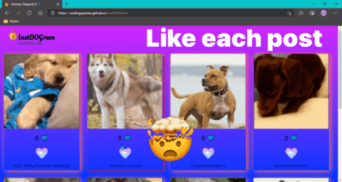
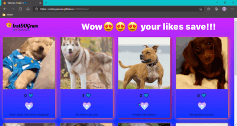

# InstDOGram 📷🐶!

### Instagram barking with dog photos!

> ### Star, so you know where to find cute dog pics! 🌟🤩

## See it here : [InstDOGram](https://codingspecies.github.io/InstDOGram/)

- <ins>Languages I used: </ins>
    - ☝ **React.js**, **JSX**, **CSS**.
- <ins>How I deployed to Github Pages </ins>
    - I used **[this](https://medium.com/mobile-web-dev/how-to-build-and-deploy-a-react-app-to-github-pages-in-less-than-5-minutes-d6c4ffd30f14)** Medium Article 

### Preview Premiere 🎬📽:

#### 1. Most importantly... The Dog Feeds!!!

#### 2. Hover over each post to get new feeds!

#### 3. You can like 👍💙 each post:

#### 4. Your likes are always saved to local storage!

<h2 align="center"> 🐶So Cool Right?🐶

### How I can improve:

- [ ] I need to make the likes universal.
- [ ] Add a light and dark mode.
- [ ] Add more posts.
- [ ] Make it possible to let others upload.
- [ ] All your suggestions, which you share in discussions!!